# Spanische Mode als politisches Instrument

Die Visualisierung konzentriert sich auf den Vergleich zwischen *Eleonora di Toledo* und *Eléonore d’Autriche* anhand ihrer beider Leben und Kleidungsstile. Im Fokus steht dabei die spanische Kleidung als politisches Instrument. Beide Frauen verkörperten in ihrer jeweiligen Epoche nicht nur Mode, sondern auch politische und kulturelle Statements.

Die Gegenüberstellung ihrer beider Leben und Kleidungsstile sowie eine kontextuelle Einordnung ihrer Zeit erfolgt systematisch anhand mehrerer Kategorien:

[Einordnung](#einordnung), [Karl V.](#karlv.), [Herkunft](#herkunft), [Heirat](#heirat), [Eheleben](#eheleben), [Politische Ziele](#politischeziele), [Spanische Kleidung](#spanischekleidung), [Französische Kleidung](#französischekleidung), [Einfluss auf Bevölkerung](#einflussaufbevölkerung), [Fazit](#fazit)

###
Diese Visualisierung basiert auf den Artikeln *"Power-Dressing at the Courts of Cosimo de’ Medici and François I: The „moda alla spagnola“ of Spanish Consorts Eléonore d’Autriche and Eleonora di Toledo" von Janet Cox-Rearick*, Vol. 30, No.60 (2009) und *"Images of a New Power: Fashion at the Florentine Court in the Mid Sixteenth Century"* von Niccoli, Bruna, and Roberta Orsi Landini. Alle zusätzlich herangezogenen Informationen werden durch "*" gekennzeichnet und die Quellen am Ende der Visualisierung aufgeführt.

---

## Einordnung

Im 16. Jahrhundert war Europa von politischen Umwälzungen, religiösen Konflikten und territorialen Rivalitäten geprägt. Die Habsburger und die Valois-Könige dominierten die politische Bühne und beeinflussten das Leben der Adeligen stark. Dies war die Zeit der Renaissance, eine Epoche des kulturellen Aufbruchs und der Wiederentdeckung antiker Künste und Wissenschaften. Eléonore d’Autriche, Schwester von Karl V., lebte in Frankreich als Königin von François I. und Eleonora di Toledo, lebte in Florenz, als Frau von Cosimo I. de' Medici, den Karl V. zum Herzog ernannt hatte. Beide Frauen  trugen die spanische Mode als Teil ihres öffentlichen Auftrittes und Ausdrucks ihrer Macht. Sie lebten in einer Zeit intensiver politischer Auseinandersetzungen und kultureller Blüte, wobei ihre Residenzen Paris und Florenz Zentren europäischer Macht und Kultur darstellten​.

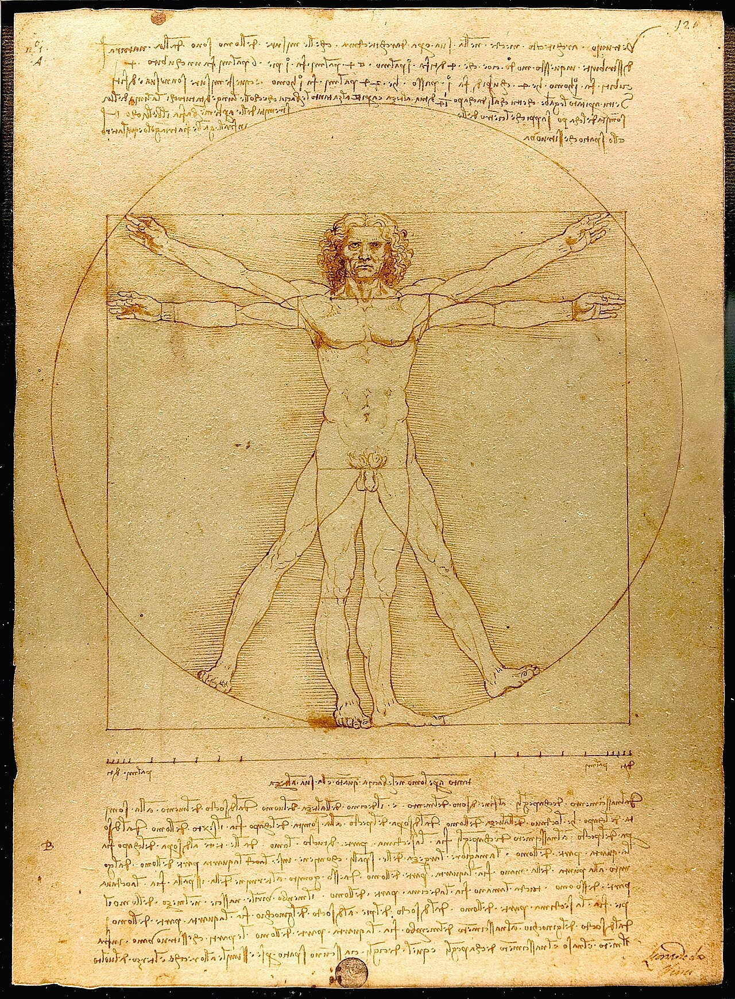

Leonardo da Vinci, *Der vitruvianische Mensch, Proportionsstudie nach Vitruv*, 1492

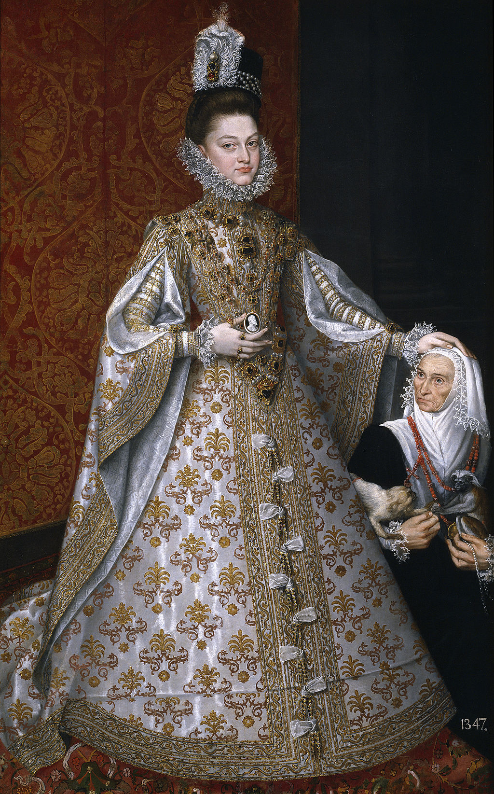

Alonso Sánchez Coello, *Infantin Isabella Clara Eugenia von Spanien*, ca. 1586

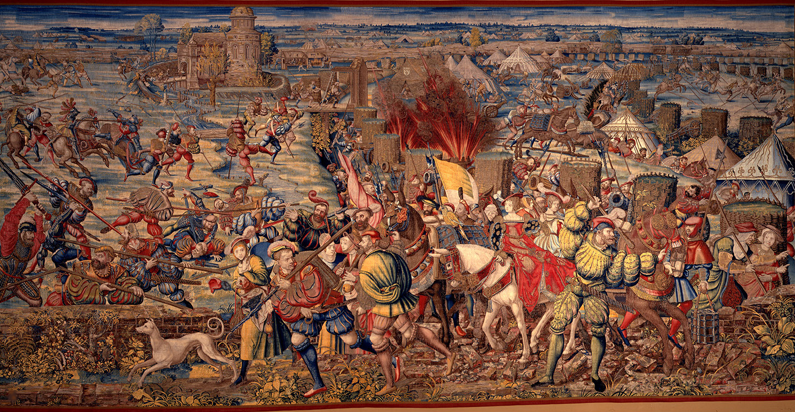

Bernard van Orley, Wandteppich, *The Battle of Pavia*, 1528-1531

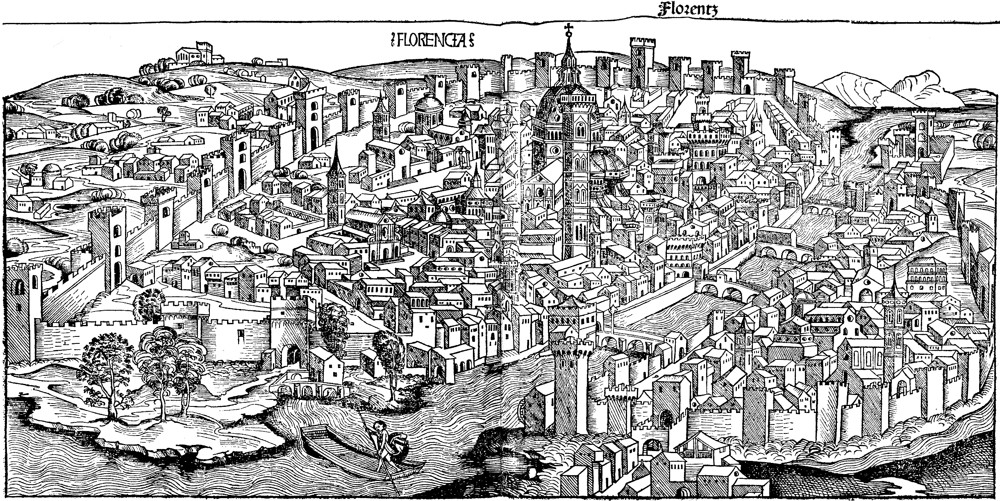

Hartmann Schedel, *Stadtansicht Florenz*, 1493

---

## Karl V.

An den europäischen Höfen des 16. Jahrhunderts wurde Kleidung häufig genutzt, um die politische Loyalität des Trägers zu bekunden, und ausländische Stile erlangten auf der politischen Bühne Europas große Bedeutung. Die politische und militärische Dominanz von Kaiser Karl V. nach 1520 führte zu einer weit verbreiteten Übernahme der spanischen Hofkleidung in Europa. Diese Modewahl wurde oft - und völlig zu Recht - als Ausdruck der Treue zum Reich verstanden. Während einige modische Einflüsse vorübergehender Natur waren und an aktuelle politische Situationen, Allianzen oder Ereignisse gebunden blieben, waren andere tief verwurzelt und von langer Dauer.

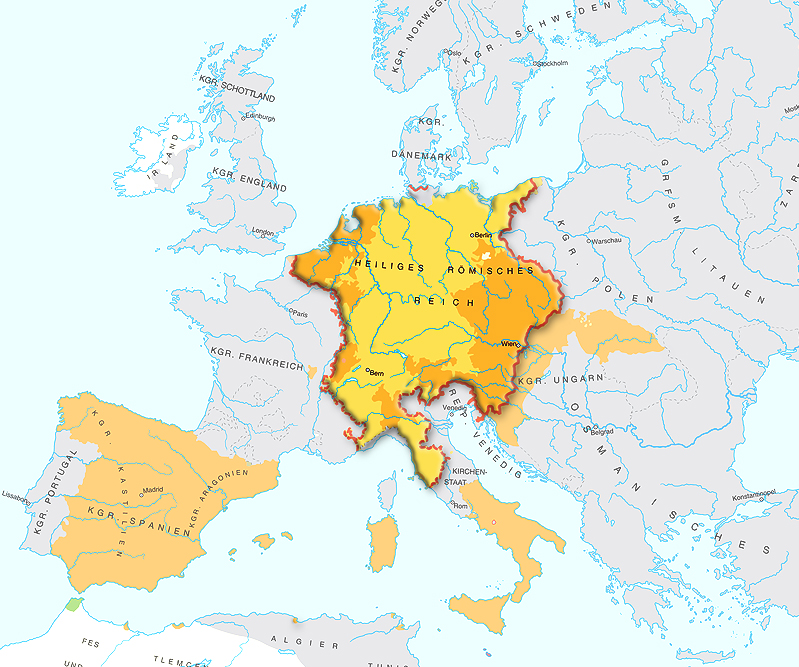

Herrschaftsgebiet Karl V.

---

## Herkunft 

Eleonora di Toledo und Eléonore d'Autriche waren beide gebürtige Spanierinnen. Sie wuchsen jedoch nicht in Spanien auf, sondern in einem der kaiserlichen Herrschaftsgebiete - Eleonora in Neapel und Eléonore in Flandern, wo die Hofkleidung der in Spanien ähnelte.

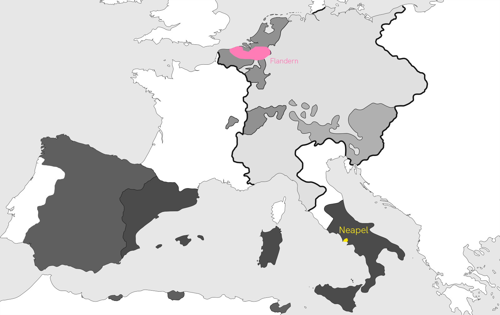

---

## Heirat

In der Zeit von Eléonore d’Autriche und Eleonora di Toledo spielten Ehen eine zentrale Rolle in der europäischen Politik des 16. Jahrhunderts. Diese Ehen dienten primär der Sicherung politischer Allianzen und territorialer Macht. Frauen wie Eléonore und Eleonora wurden als Werkzeuge der Diplomatie eingesetzt, um durch Heiraten zwischen Königreichen und Fürstentümern Frieden zu sichern und politische Unterstützung zu gewinnen. Die Ehebündnisse waren entscheidend für die Ausweitung des Territoriums und die Legitimierung von Ansprüchen auf neue Länder. Durch diese Verbindungen wurden auch familiäre Netzwerke gestärkt und Rivalitäten vermieden. Die Frauen selbst hatten durch ihre Ehen direkten politischen Einfluss, indem sie als Beraterinnen ihrer Ehemänner fungierten und politische Entscheidungen beeinflussten. Zusätzlich förderten Ehen zwischen Herrschern unterschiedlicher Länder den kulturellen Austausch und den Transfer von Wissen, was sowohl kulturelle als auch politische Auswirkungen auf die betroffenen Gesellschaften hatte. Insgesamt waren Ehen und Heiraten daher entscheidende strategische Instrumente zur Stärkung von Macht, Einfluss und Sicherheit in einer Zeit, die von intensiven politischen und territorialen Konflikten geprägt war.

---

## Eheleben

Lorem ipsum dolor sit amet, consetetur sadipscing elitr, sed diam nonumy eirmod tempor invidunt ut labore et dolore magna aliquyam erat, sed diam voluptua. At vero eos et accusam et justo duo dolores et ea rebum. Stet clita kasd gubergren, no sea takimata sanctus est Lorem ipsum dolor sit amet. Lorem ipsum dolor sit amet, consetetur sadipscing elitr, sed diam nonumy eirmod tempor invidunt ut labore et dolore magna aliquyam erat, sed diam voluptua. At vero eos et accusam et justo duo dolores et ea rebum. Stet clita kasd gubergren, no sea takimata sanctus est Lorem ipsum dolor sit amet.

---

## Politische Ziele

Im 16. Jahrhundert waren Frankreich und Spanien erbitterte Rivalen. Dynastische Spannungen zwischen den Habsburgern und den Valois-Königen, insbesondere durch die Figuren Karl V. und Philipp II., sowie Franz I. und Heinrich II., prägten die Epoche. Territorialkonflikte wie die Italienischen Kriege und religiöse Spannungen zwischen Katholiken und Protestanten verschärften die Situation. Spanien profitierte wirtschaftlich von seinen Kolonien, während Frankreich ebenfalls koloniale Bestrebungen verfolgte. Diplomatische Allianzen und Heiraten, wie die von Eléonore d’Autriche und Franz I., konnten die Spannungen nicht vollständig lösen, und zahlreiche militärische Konflikte waren die Folge.

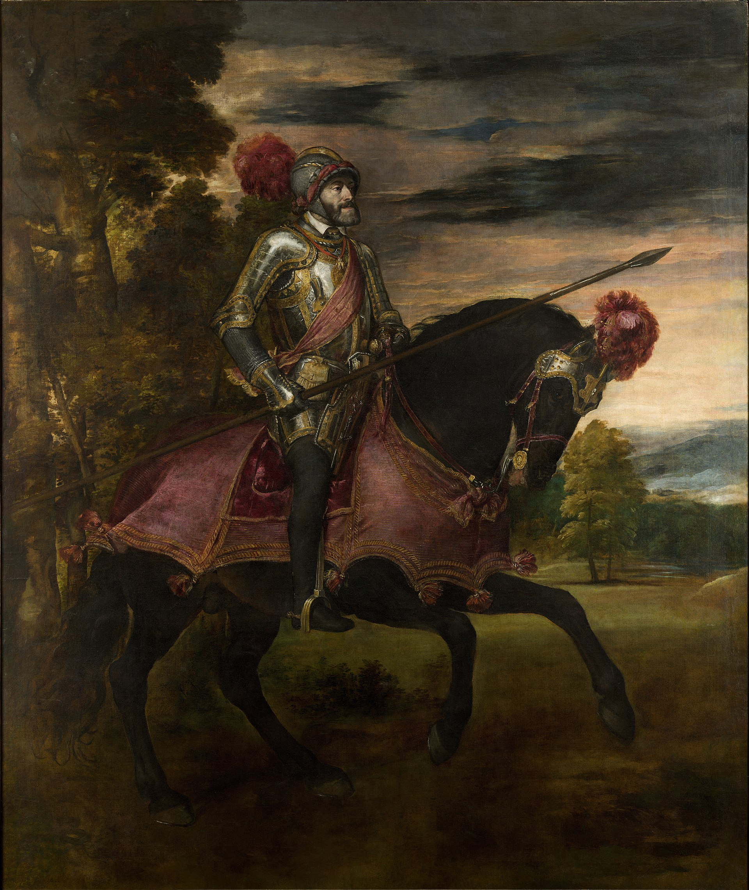

Titian, *Kaiser Karl V. nach der Schlacht bei Mühlberg*, 1548

---

## Spanische Kleidung

Insgesamt spielte die spanische Kleidung im 16. Jahrhundert eine zentrale Rolle in der Darstellung von Macht, Status und kultureller Raffinesse an den Höfen Europas. Sie war nicht nur Ausdruck individuellen Geschmacks, sondern auch ein wichtiges Mittel zur Kommunikation politischer und kultureller Botschaften in einer Zeit intensiver politischer und religiöser Konflikte.
Typisch spanische Kleidungselemente im 16. Jahrhundert umfassten mehrere charakteristische Merkmale, die die Mode dieser Zeit prägten: Hohe Kragen (Gorgerinas), Weite Ärmel (Farolitos), Verzierungen und Stickereien, Umhänge (Capas), Schärpen und Gürtel (Fajas und Tocados) und die Verwendung von Seide und Samt.
Diese Elemente zusammen verliehen der spanischen Mode im 16. Jahrhundert eine unverwechselbare Eleganz und Pracht, die sie zu einem bedeutenden Einflussfaktor in der europäischen Mode dieser Zeit machte.

Im folgenden Teil der Visualisierung wird konkret auf den Vergleich zwischen Eleonora di Toledo und Eléonore d’Autriche anhand ihrer spanischen Kleidung eingegangen.

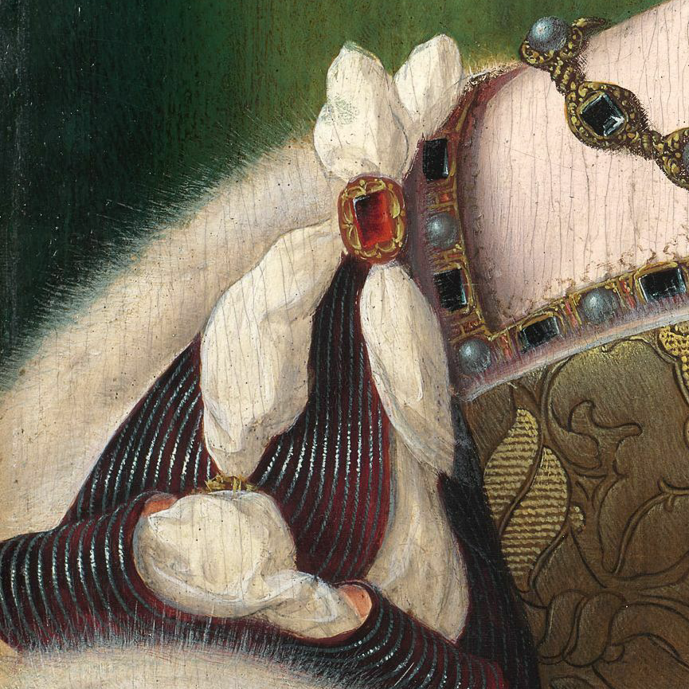

Joos van Cleve, Detail vom Porträt *Eléonore d’Autriche*, 1532/33

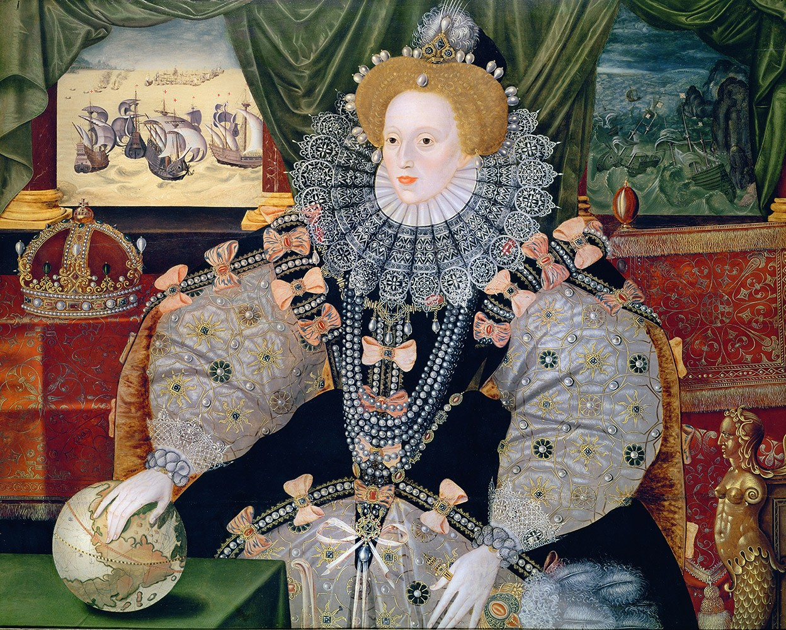

Unbekannter englischer Künstler, *Elizabeth I (Armada Portrait)*, 1588

Alonso Sánchez Coello, *Infantin Isabella Clara Eugenia von Spanien*, ca. 1586

Hans von Aachen, *Erzherzogin Anna von Österreich*, 1604

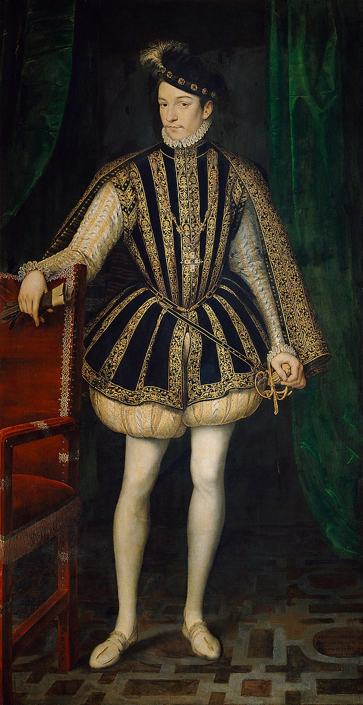

François Clouet, *König Karl IX. von Frankreich*, 1569

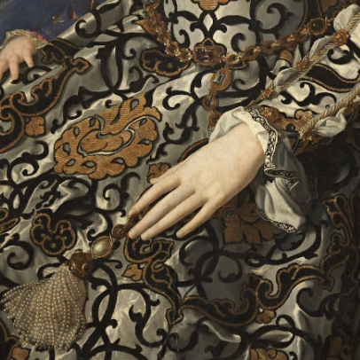

Agnolo Bronzino, Detail vom *Porträt Eleonora di Toledo mit ihrem Sohn Giovanni*,1545

---

## Französische Kleidung

Nach ihrer Ankunft in Blois und Paris wurde Eléonore am 5. März 1531 in St. Denis gekrönt und zog am 16. März feierlich in die Stadt ein. Die Chronisten erwähnten ihre spanische Kleidung nicht, da sie verpflichtet war, bei der Krönung und dem Einzug offizielle, identische französische Zeremoniengewänder zu tragen. Laut Guillaume Bochetels Bericht über diese Ereignisse trug sie einen purpurnen Königsmantel, verziert mit goldenen Bändern, ein mit Perlen besticktes Mieder, ein mit Hermelin besetztes Überkleid (Surcot) und eine Krone aus Juwelen und Perlen. Außerdem erwähnte Bochetel, dass die zwölf Damen, die Eléonore aus Kastilien mitgebracht hatte, purpurnen Satin „à la mode de leur pays" (nach der Mode ihres Landes, spanisch) trugen, während die französischen Dienerinnen in Satin oder Samt „à la mode de France" gekleidet waren. Die Kleidung von Eléonores Gefolge bei diesen Zeremonien bestätigt somit ihre programmierte Präsentation in spanischer Kleidung bei all ihren Auftritten.

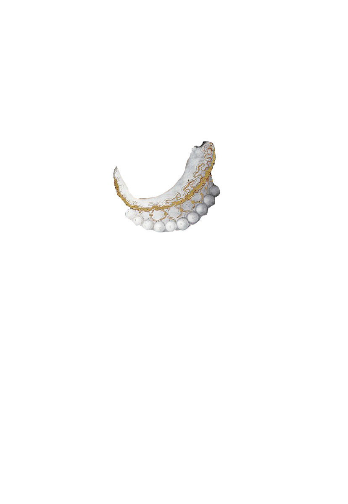

Stehkrahen

---

## Einfluss auf Bevölkerung

Der Einfluss spanischer Kleidung auf die Bevölkerung des 16. Jahrhunderts war tiefgreifend. Sie setzte neue Standards für Eleganz und Pracht, diente als Symbol für Macht und sozialen Status und beeinflusste die Modevorstellungen weit über die Grenzen Spaniens hinaus. Die spanische Mode prägte nicht nur die adeligen Höfe, sondern auch die bürgerliche Gesellschaft, was zu einer breiten Adaption und Anpassung dieser Stile führte. Die Verbreitung und Akzeptanz der spanischen Kleidung war ein Zeichen des kulturellen Austauschs und der politischen Verbindungen in einer Zeit, die von dynastischen Ehen und territorialen Machtkämpfen geprägt war.

Stehkrahen

---

## Fazit

Beide Eleonoras trugen spanische Kleidung, um ihr Kaisertum zu behaupten Loyalität und Identität, aber politisch repräsentierten sie entgegengesetzte Seiten der Medaille.
Die Beziehungen zu ihren Ehemännern spielten dabei eine zentrale Rolle.
Während Eléonore von Habsburg ihre spanische Kleidung als Symbol ihrer kaiserlichen Herkunft und ihrer komplexen politischen Rolle zwischen Frankreich und dem Heiligen Römischen Reich trug, nutzte Eleonora di Toledo die gleiche Mode, um die Bindung ihres Ehemanns an den Kaiser und dessen Ambitionen zu unterstreichen.
Zusammenfassend lässt sich sagen, dass die spanische Kleidung beider Eléonores nicht nur ein Ausdruck persönlicher Loyalität und kaiserlicher Identität war, sondern auch die politischen Beziehungen und Verpflichtungen ihrer Ehemänner widerspiegelte. Die Wahl der Kleidung war somit eine strategische Entscheidung, die die politischen Allianzen und Machtstrukturen ihrer Zeit sichtbar machte.

Stehkrahen

---

## Quellen

---

## xxx

The *Syllabus Site* template can be easily used with minimal technical requirements.

  
Page content and source side by side

### Get started

1. Download or clone the [GitHub repository](https://github.com/uclab-potsdam/syllabus-site/)
2. Give your page a title, fill out open graph fields, and adjust theme color in `index.html`
3. Add your content into `README.md` and `img/`

### Files

The template has the following file structure:

      img/
      index.html
      src/
      README.md

The `README.md` file contains all the textual content of your page and references the images that you need to add to the `img/` directory. 

The `index.html` file connects template and your content; here you need to make a few edits to add title, description, and preview of your webpage. 

You do not need to change anything within `src/`, which contains the internal files of the template.

### Syntax

The `README.md` uses the [Markdown](https://en.wikipedia.org/wiki/Markdown) format, a markup language used by many platforms including GitHub.

There are two conventions we introduce to distinguish and connect sections and items:

- **Sections** are delineated by a horizontal rule `---` 
- **Items** are separated by two empty consecutive lines

Each section should contain a heading:
`#` for primary, `##` for secondary, and so on.

To exclude a section from the navigation menu, include `<!--skipnav-->` at the start of the section.

### Things to consider

- Include an expressive preview image `img/cover.png` so that your page can be previewed on social media and messaging apps.
- Given that your webpage might be accessed from a mobile device with a slow connection make sure to optimize image file sizes.

---

## Credits

*Syllabus Site* was put together by [Philipp Proff](https://philippproff.eu) and [Marian Dörk](https://mariandoerk.de) with the helping hands from many people.

**Markdown munching**: [Marked](https://marked.js.org) by Christopher Jeffrey

**Terrific typeface**: [HK Grotesk](https://github.com/HankenDesignCo/HK-Grotesk) by Alfredo Marco Pradil

**Friendly feedback**: Myriel Milicevic, Lamin Manneh, Fidel Thomet, Mark-Jan Bludau, Sabine de Günther and Francesca Morini

**Yes, you!**: Syllabus Site is [made available](https://github.com/uclab-potsdam/syllabus-site/) under the liberal MIT license. Feel free to reuse and revise it!

---

 
 

[Contact](mailto:marian.doerk@fh-potsdam.de,philipp.proff@gmx.de?subject=Syllabus%20Site) · [Imprint](https://www.fh-potsdam.de/impressum) · *This is a [Syllabus Site](https://infovis.fh-potsdam.de/syllabus-site/)*
