# Spanische Mode als politisches Instrument

Die Visualisierung konzentriert sich auf den Vergleich zwischen Eleonora di Toledo und Eléonore d’Autriche anhand verschiedener Punkte.
Im Fokus steht dabei die spanische Kleidung als politisches Instrument. Beide Frauen verkörperten in ihrer jeweiligen Epoche nicht nur Mode, sondern auch politische und kulturelle Statements.

Die Gegenüberstellung ihrer beider Leben und Kleidungsstile erfolgt systematisch anhand mehrerer Kategorien:

[Herkunft](#herkunft), [Karl V.](#karlv.), [Heirat](#heirat), [Ehemänner](#ehemänner), [Eheleben](#eheleben), [Spanische Kleidung](#spanischekleidung) ..  

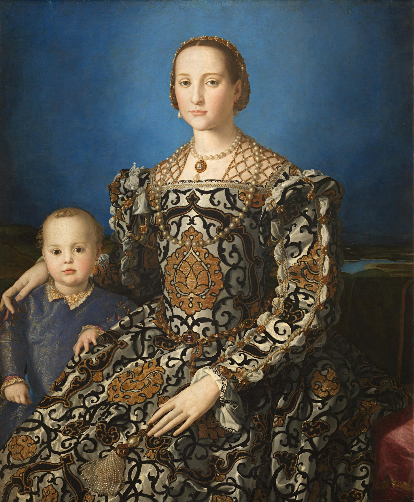

Agnolo Bronzino, Eleonora di Toledo mit ihrem Sohn Giovanni, ca. 1545

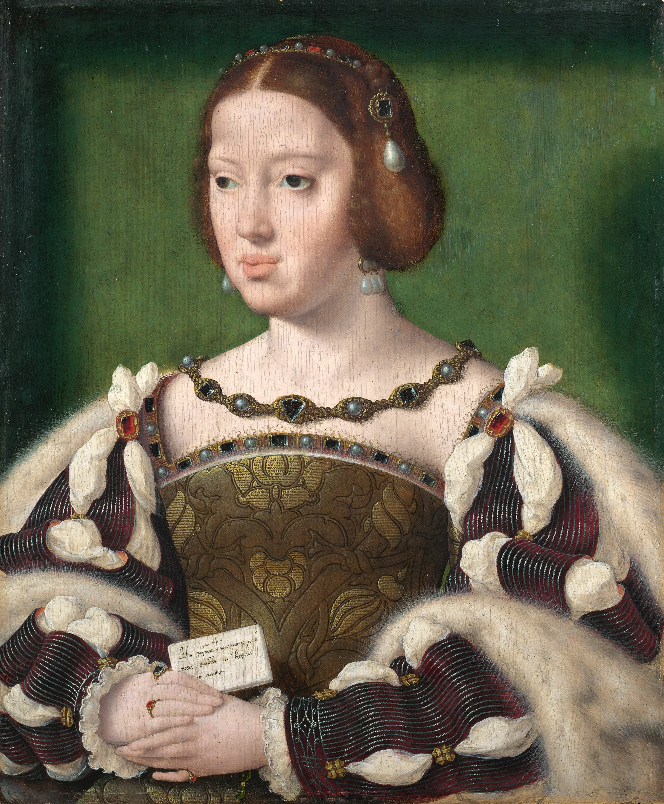

Joos van Cleves, Éléonore d’Autriche, 1532/33

---

## Herkunft 

### 

//Bild mit Text einfügen 
Lorem ipsum dolor sit amet, consetetur sadipscing elitr, sed diam nonumy eirmod tempor invidunt ut labore et dolore magna aliquyam erat, sed diam voluptua. At vero eos et accusam et justo duo dolores et ea rebum. Stet clita kasd gubergren, no sea takimata sanctus est Lorem ipsum dolor sit amet. Lorem ipsum dolor sit amet, consetetur sadipscing elitr, sed diam nonumy eirmod tempor invidunt ut labore et dolore magna aliquyam erat, sed diam voluptua. At vero eos et accusam et justo duo dolores et ea rebum. Stet clita kasd gubergren, no sea takimata sanctus est Lorem ipsum dolor sit amet.

### 

//Bild mit Text einfügen 
Lorem ipsum dolor sit amet, consetetur sadipscing elitr, sed diam nonumy eirmod tempor invidunt ut labore et dolore magna aliquyam erat, sed diam voluptua. At vero eos et accusam et justo duo dolores et ea rebum. Stet clita kasd gubergren, no sea takimata sanctus est Lorem ipsum dolor sit amet. Lorem ipsum dolor sit amet, consetetur sadipscing elitr, sed diam nonumy eirmod tempor invidunt ut labore et dolore magna aliquyam erat, sed diam voluptua. At vero eos et accusam et justo duo dolores et ea rebum. Stet clita kasd gubergren, no sea takimata sanctus est Lorem ipsum dolor sit amet.

---

## Karl V.

An den europäischen Höfen des 16. Jahrhunderts wurde Kleidung häufig genutzt, um die politische Loyalität des Trägers zu bekunden, und ausländische Stile erlangten auf der politischen Bühne Europas große Bedeutung.
Die politische und militärische Dominanz von Kaiser Karl V. nach 1520 führte zu einer weit verbreiteten Übernahme der spanischen Hofkleidung in Europa. Diese Modewahl wurde oft - und völlig zu Recht - als Ausdruck der Treue zum Reich verstanden. Während einige modische Einflüsse vorübergehender Natur waren und an aktuelle politische Situationen, Allianzen oder Ereignisse gebunden blieben, waren andere tief verwurzelt und von langer Dauer.

Herrschaftsgebiet Karl V.

---

## Ehemänner

//Beschreibung/Vorstellung der Ehemänner der beiden Eleonoras

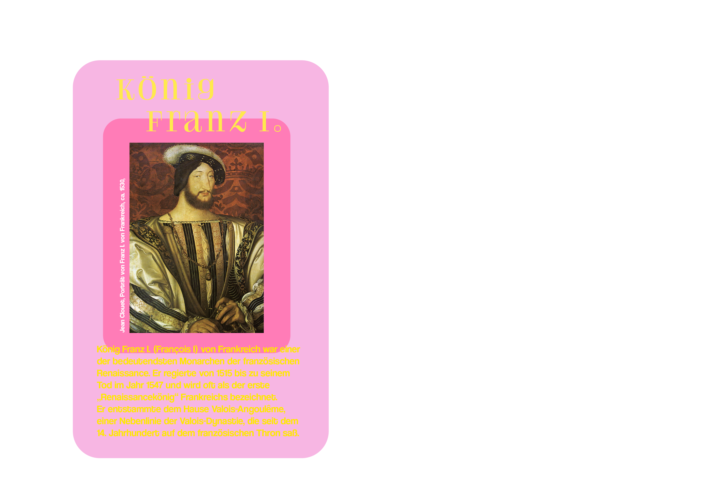

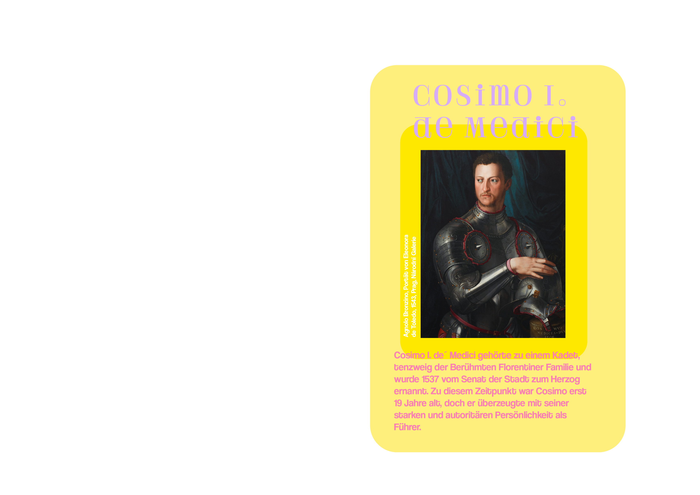

---

## Eheleben

//Beschreibung/Vorstellung der Ehemänner der beiden Eleonoras

---

## Spanische Kleidung

//Beschreibung/Vorstellung der Spanischen Kleidung der beiden Eleonoras

---

## xxx

The *Syllabus Site* template can be easily used with minimal technical requirements.

  
Page content and source side by side

### Get started

1. Download or clone the [GitHub repository](https://github.com/uclab-potsdam/syllabus-site/)
2. Give your page a title, fill out open graph fields, and adjust theme color in `index.html`
3. Add your content into `README.md` and `img/`

### Files

The template has the following file structure:

      img/
      index.html
      src/
      README.md

The `README.md` file contains all the textual content of your page and references the images that you need to add to the `img/` directory. 

The `index.html` file connects template and your content; here you need to make a few edits to add title, description, and preview of your webpage. 

You do not need to change anything within `src/`, which contains the internal files of the template.

### Syntax

The `README.md` uses the [Markdown](https://en.wikipedia.org/wiki/Markdown) format, a markup language used by many platforms including GitHub.

There are two conventions we introduce to distinguish and connect sections and items:

- **Sections** are delineated by a horizontal rule `---` 
- **Items** are separated by two empty consecutive lines

Each section should contain a heading:
`#` for primary, `##` for secondary, and so on.

To exclude a section from the navigation menu, include `<!--skipnav-->` at the start of the section.

### Things to consider

- Include an expressive preview image `img/cover.png` so that your page can be previewed on social media and messaging apps.
- Given that your webpage might be accessed from a mobile device with a slow connection make sure to optimize image file sizes.

---

## Details

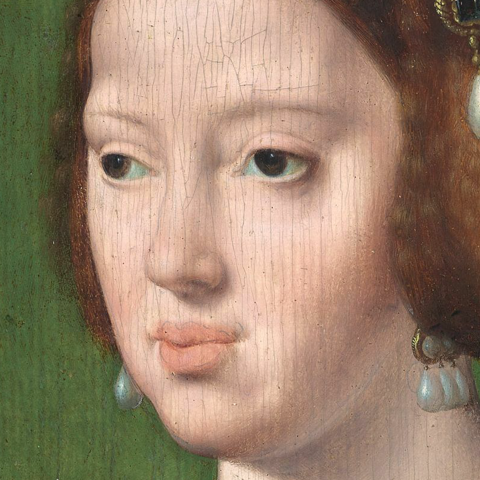

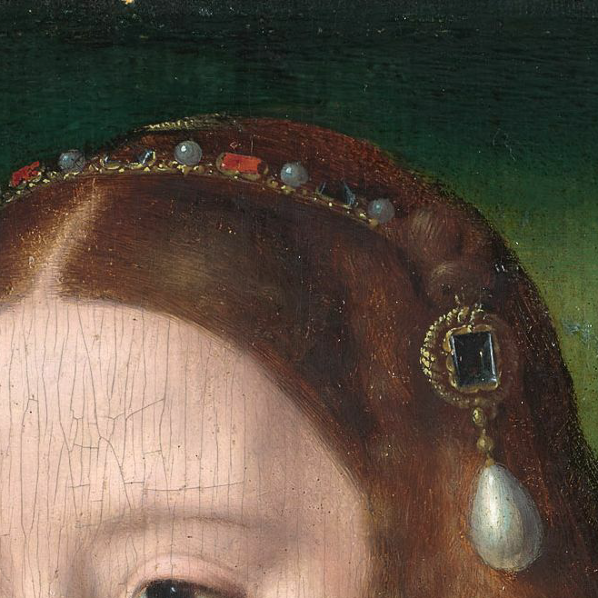

Haarschmuck mit Brosche 

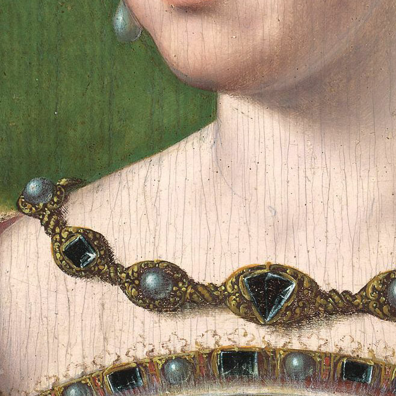

Kette aus Perlen und Edelsteinen

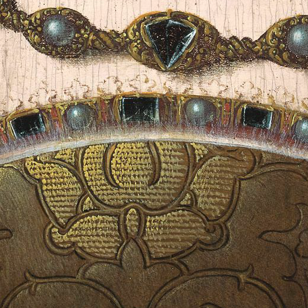

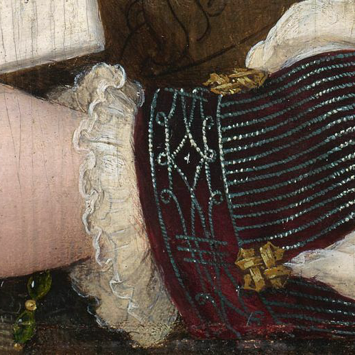

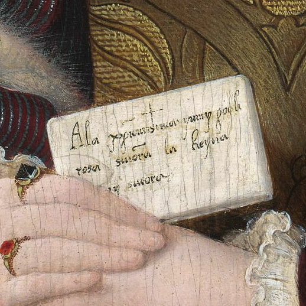

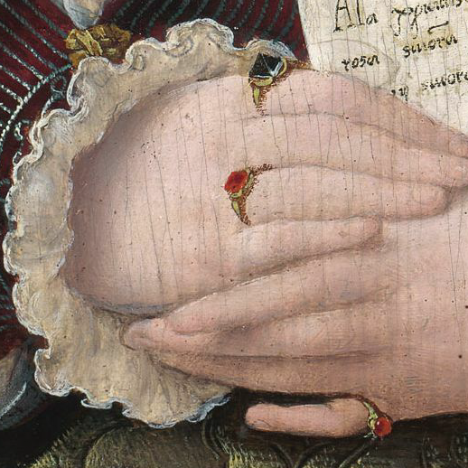

---

## xxx

*Syllabus Site* was put together by [Philipp Proff](https://philippproff.eu) and [Marian Dörk](https://mariandoerk.de) with the helping hands from many people.

**Markdown munching**: [Marked](https://marked.js.org) by Christopher Jeffrey

**Terrific typeface**: [HK Grotesk](https://github.com/HankenDesignCo/HK-Grotesk) by Alfredo Marco Pradil

**Friendly feedback**: Myriel Milicevic, Lamin Manneh, Fidel Thomet, Mark-Jan Bludau, Sabine de Günther and Francesca Morini

**Yes, you!**: Syllabus Site is [made available](https://github.com/uclab-potsdam/syllabus-site/) under the liberal MIT license. Feel free to reuse and revise it!

---

 
 

[Contact](mailto:marian.doerk@fh-potsdam.de,philipp.proff@gmx.de?subject=Syllabus%20Site) · [Imprint](https://www.fh-potsdam.de/impressum) · *This is a [Syllabus Site](https://infovis.fh-potsdam.de/syllabus-site/)*
