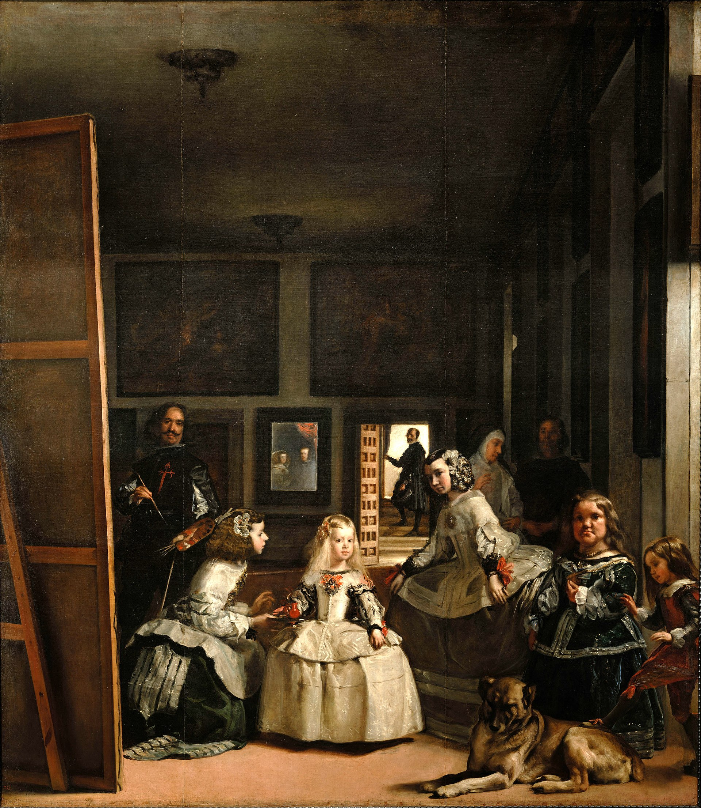

# „Moda alla spagnola“
# Ein modisches Powerplay

Die Visualisierung konzentriert sich auf den Vergleich zwischen *Eleonora di Toledo* und *Eléonore d’Autriche* anhand ihrer beider Leben und Kleidungsstile. Im Fokus steht dabei die spanische Kleidung als politisches Instrument. Beide Frauen verkörperten in ihrer jeweiligen Epoche nicht nur Mode, sondern auch politische und kulturelle Statements.

Die Gegenüberstellung ihrer beider Leben und Kleidungsstile sowie eine kontextuelle Einordnung ihrer Zeit erfolgt systematisch anhand mehrerer Kategorien:

[Einordnung](#einordnung),  [Karl V.](#karlv.),  [Herkunft](#herkunft),  [Heirat](#heirat),  [Eheleben](#eheleben),  [Politische Ziele](#politischeziele),  [Spanische Kleidung](#spanischekleidung),  [Französische Kleidung](#franzoesischekleidung),  [Einfluss auf Bevölkerung](#einflussaufbevoelkerung),  [Fazit](#fazit)

###
Diese Visualisierung basiert auf den Artikeln:
- *"Power-Dressing at the Courts of Cosimo de’ Medici and François I: The „moda alla spagnola“ of Spanish Consorts Eléonore d’Autriche and Eleonora di Toledo" von Janet Cox-Rearick*, Vol. 30, No.60 (2009)
- *"Images of a New Power: Fashion at the Florentine Court in the Mid Sixteenth Century"* von Niccoli, Bruna, and Roberta Orsi Landini
  
Alle zusätzlich herangezogenen Informationen werden durch "*" gekennzeichnet und die Quellen am Ende der Visualisierung aufgeführt.

---

## Einordnung

Im 16. Jahrhundert war Europa von politischen Umwälzungen, religiösen Konflikten und territorialen Rivalitäten geprägt. Die Habsburger und die Valois-Könige dominierten die politische Bühne und beeinflussten das Leben der Adeligen stark. Dies war die Zeit der Renaissance, eine Epoche des kulturellen Aufbruchs und der Wiederentdeckung antiker Künste und Wissenschaften.*1

Eléonore d’Autriche, Schwester von Karl V., lebte in Frankreich als Königin von François I. und Eleonora di Toledo, lebte in Florenz, als Frau von Cosimo I. de' Medici, den Karl V. zum Herzog ernannt hatte. 

Beide Frauen  trugen die spanische Mode als Teil ihres öffentlichen Auftrittes und Ausdrucks ihrer Macht. Sie lebten in einer Zeit intensiver politischer Auseinandersetzungen und kultureller Blüte, wobei ihre Residenzen Paris und Florenz Zentren europäischer Macht und Kultur darstellten​.

Leonardo da Vinci, *Der vitruvianische Mensch, Proportionsstudie nach Vitruv*, 1492

Alonso Sánchez Coello, *Infantin Isabella Clara Eugenia von Spanien*, ca. 1586

Bernard van Orley, Wandteppich, *The Battle of Pavia*, 1528-1531

Hartmann Schedel, *Stadtansicht Florenz*, 1493

---

## Karl V.

An den europäischen Höfen wurde Kleidung häufig genutzt, um die politische Loyalität des Trägers zu bekunden, und ausländische Stile erlangten auf der politischen Bühne Europas große Bedeutung. 

Die politische und militärische Dominanz von Kaiser Karl V. nach 1520 führte zu einer weit verbreiteten Übernahme der spanischen Hofkleidung in Europa. Diese Modewahl wurde oft - und völlig zu Recht - als Ausdruck der Treue zum Reich verstanden. Während einige modische Einflüsse vorübergehender Natur waren und an aktuelle politische Situationen, Allianzen oder Ereignisse gebunden blieben, waren andere tief verwurzelt und von langer Dauer.*2

Herrschaftsgebiet Karl V.

Wappen Kaiser Karl V.

---

## Herkunft 

Eleonora di Toledo und Eléonore d'Autriche waren beide gebürtige Spanierinnen. Sie wuchsen jedoch nicht in Spanien auf, sondern in einem der kaiserlichen Herrschaftsgebiete - Eleonora in Neapel und Eléonore in Flandern, wo die Hofkleidung der in Spanien ähnelte.

---

## Heirat

Frauen wie Eléonore und Eleonora wurden als Werkzeuge der Diplomatie eingesetzt, um durch Heiraten zwischen Königreichen und Fürstentümern Frieden zu sichern und politische Unterstützung zu gewinnen. Die Ehebündnisse waren entscheidend für die Ausweitung des Territoriums und die Legitimierung von Ansprüchen auf neue Länder. Durch diese Verbindungen wurden auch familiäre Netzwerke gestärkt und Rivalitäten vermieden. 

Ehen und Heiraten zur damaligen Zeit waren daher entscheidende strategische Instrumente zur Stärkung von Macht, Einfluss und Sicherheit in einer Zeit, die von intensiven politischen und territorialen Konflikten geprägt war.

---

## Eheleben
Die Ehen in der damaligigen Zeit spielten eine entscheidende Rolle in der Politik und Gesellschaft, insbesondere in Europa, wo politische Allianzen und territoriale Macht oft durch dynastische Ehen gesichert wurden.
Die Frauen selbst hatten durch ihre Ehen direkten politischen Einfluss, indem sie als Beraterinnen ihrer Ehemänner fungierten und politische Entscheidungen beeinflussten. 

Das Eheleben von Eléonore d’Autriche und Eleonora di Toledo unterschied sich deutlich aufgrund ihrer unterschiedlichen persönlichen und politischen Umstände.

---

## Politische Ziele

Im 16. Jahrhundert waren Frankreich und Spanien erbitterte Rivalen. Dynastische Spannungen zwischen den Habsburgern und den Valois-Königen, insbesondere durch die Figuren Karl V. und Philipp II., sowie Franz I. und Heinrich II., prägten die Epoche. 

Territorialkonflikte wie die Italienischen Kriege und religiöse Spannungen zwischen Katholiken und Protestanten verschärften die Situation. Spanien profitierte wirtschaftlich von seinen Kolonien, während Frankreich ebenfalls koloniale Bestrebungen verfolgte. 

Diplomatische Allianzen und Heiraten, wie die von Eléonore d’Autriche und Franz I., konnten die Spannungen nicht vollständig lösen, und zahlreiche militärische Konflikte waren die Folge.*4

Titian, *Kaiser Karl V. nach der Schlacht bei Mühlberg*, 1548

---

## Spanische Kleidung

Insgesamt spielte die spanische Kleidung eine zentrale Rolle in der Darstellung von Macht, Status und kultureller Raffinesse an den Höfen Europas. Sie war nicht nur Ausdruck individuellen Geschmacks, sondern auch ein wichtiges Mittel zur Kommunikation politischer und kultureller Botschaften in einer Zeit intensiver politischer und religiöser Konflikte.
Typisch spanische Kleidungselemente im 16. Jahrhundert umfassten mehrere charakteristische Merkmale, die die Mode dieser Zeit prägten: 
- Hohe Kragen (Gorgerinas)
- Weite Ärmel (Farolitos)
- Verzierungen und Stickereien
- Umhänge (Capas)
- Schärpen und Gürtel (Fajas und Tocados) 
- Verwendung von Seide und Samt
  
Diese Elemente zusammen verliehen der spanischen Mode eine unverwechselbare Eleganz und Pracht, die sie zu einem bedeutenden Einflussfaktor in der europäischen Mode dieser Zeit machte.

Im folgenden Teil der Visualisierung wird konkret auf den Vergleich zwischen Eleonora di Toledo und Eléonore d’Autriche anhand ihrer spanischen Kleidung eingegangen.

Joos van Cleve, Detail vom Porträt *Eléonore d’Autriche*, 1532/33

Unbekannter englischer Künstler, *Elizabeth I (Armada Portrait)*, 1588

Alonso Sánchez Coello, *Infantin Isabella Clara Eugenia von Spanien*, ca. 1586

Hans von Aachen, *Erzherzogin Anna von Österreich*, 1604

Um 1500 wurde spanische Kleidung in verschiedenen Teilen Europas und den Kolonien getragen:
1. In den königlichen Residenzen wie dem Alcázar von Sevilla und dem Palacio Real in Madrid war spanische Kleidung vorherrschend. 
2. Die Oberschicht in Spanien, einschließlich der Städte Toledo, Barcelona und Granada, trug aufwendige spanische Kleidung, die durch schwere Stoffe, dunkle Farben und reichhaltige Verzierungen gekennzeichnet war.
3. In den von Spanien kontrollierten Gebieten in Italien, wie Neapel und Sizilien, war spanische Kleidung ein Zeichen der politischen und kulturellen Dominanz sowie in den österreichischen und deutschen Gebieten des Habsburgerreichs. 
Wo Karl V. regierte, war spanische Mode ebenfalls weit verbreitet. Seine Herrschaft und seine Heiratsallianzen verbreiteten die spanische Kleidung in Mitteleuropa.
4. Die spanische Mode beeinflusste auch die Höfe in Frankreich, England und den Niederlanden, wo Adelige und Königinnen, die durch Heirat mit der spanischen Krone verbunden waren, den Stil übernahmen.
 
Diese Orte spiegeln die weitreichende politische, kulturelle und koloniale Macht Spaniens wider, die dazu führte, dass die spanische Mode in vielen Teilen der Welt anerkannt und getragen wurde​.*5

François Clouet, *König Karl IX. von Frankreich*, 1569

Agnolo Bronzino, Detail vom *Porträt Eleonora di Toledo mit ihrem Sohn Giovanni*,1545

---

## Stoffe

Lorem ipsum dolor sit amet, consetetur sadipscing elitr, sed diam nonumy eirmod tempor invidunt ut labore et dolore magna aliquyam erat, sed diam voluptua. At vero eos et accusam et justo duo dolores et ea rebum. Stet clita kasd gubergren, no sea takimata sanctus est Lorem ipsum dolor sit amet. Lorem ipsum dolor sit amet, consetetur sadipscing elitr, sed diam nonumy eirmod tempor invidunt ut labore et dolore magna aliquyam erat, sed diam voluptua. At vero eos et accusam et justo duo dolores et ea rebum. Stet clita kasd gubergren, no sea takimata sanctus est Lorem ipsum dolor sit amet.

---

## Zimarra

Lorem ipsum dolor sit amet, consetetur sadipscing elitr, sed diam nonumy eirmod tempor invidunt ut labore et dolore magna aliquyam erat, sed diam voluptua. At vero eos et accusam et justo duo dolores et ea rebum. Stet clita kasd gubergren, no sea takimata sanctus est Lorem ipsum dolor sit amet. Lorem ipsum dolor sit amet, consetetur sadipscing elitr, sed diam nonumy eirmod tempor invidunt ut labore et dolore magna aliquyam erat, sed diam voluptua. At vero eos et accusam et justo duo dolores et ea rebum. Stet clita kasd gubergren, no sea takimata sanctus est Lorem ipsum dolor sit amet.

---

## Schmuck

Lorem ipsum dolor sit amet, consetetur sadipscing elitr, sed diam nonumy eirmod tempor invidunt ut labore et dolore magna aliquyam erat, sed diam voluptua. At vero eos et accusam et justo duo dolores et ea rebum. Stet clita kasd gubergren, no sea takimata sanctus est Lorem ipsum dolor sit amet. Lorem ipsum dolor sit amet, consetetur sadipscing elitr, sed diam nonumy eirmod tempor invidunt ut labore et dolore magna aliquyam erat, sed diam voluptua. At vero eos et accusam et justo duo dolores et ea rebum. Stet clita kasd gubergren, no sea takimata sanctus est Lorem ipsum dolor sit amet.

---

## Französische Kleidung

Typische französische Frauenkleidung um 1500 war durch Eleganz und Reichtum gekennzeichnet. Zentrale Elemente der Kleidung waren: 
- der *Hennin*, eine hohe, konische Kopfbedeckung, oft mit einem Schleier versehen  
- eine *Houppelande*, ein weites, bodenlanges Gewand mit breiten Ärmeln, das reich verziert und häufig mit Pelz besetzt war
- einen *Surcot*, der oft ärmellos war und durch Schlitze an den Seiten das darunterliegende Kleid sichtbar machte
- das *Sideless Gown*, ein Kleidungsstück ohne Seiten, das über einem anderen Kleid getragen wurde und oft reich bestickt war Unter dem Hennin
- eine *Haube*, eine eng anliegende Kopfbedeckung, die ebenfalls oft verziert war 
- ein tiefes, quadratisches oder rundes Dekolleté, das bei höfischen Anlässen zur Schau gestellt wurde*4

Unbekannter französischer Künstler, *Claude de France mit ihren Töchtern, sowie ihrer Schwester und Eléonore d’Autriche (hinten links)*, 1528

Haube

Die französische Mode entwickelte sich stark am königlichen Hof in Frankreich, insbesondere in Paris und im Louvre-Palast. Der Hof war ein Zentrum für Mode, Kunst und Kultur. Neben dem königlichen Hof trugen Adelige und Aristokraten in ihren Residenzen und Schlössern in ganz Frankreich französische Mode. Wichtige Orte waren z.B. das Château de Chambord und das Château de Fontainebleau.*4

Stehkragen

---

## Einfluss auf Bevölkerung

Der Einfluss spanischer Kleidung auf die Bevölkerung war tiefgreifend. Sie setzte neue Standards für Eleganz und Pracht, diente als Symbol für Macht und sozialen Status und beeinflusste die Modevorstellungen weit über die Grenzen Spaniens hinaus. 

Die spanische Mode prägte nicht nur die adeligen Höfe, sondern auch die bürgerliche Gesellschaft, was zu einer breiten Adaption und Anpassung dieser Stile führte. Die Verbreitung und Akzeptanz der spanischen Kleidung war ein Zeichen des kulturellen Austauschs und der politischen Verbindungen in einer Zeit, die von dynastischen Ehen und territorialen Machtkämpfen geprägt war.*5

[Diego Velázquez, *Las Meninas*, 1656](https://de.wikipedia.org/wiki/Las_Meninas#/media/Datei:Las_Meninas_(1656),_by_Velazquez.jpg) 

---

## Fazit

Beide Eleonoras trugen spanische Kleidung, um ihre Loyalität und Identität zum Kaisertum zu behaupten, aber politisch repräsentierten sie entgegengesetzte Seiten der Medaille.

Die Beziehungen zu ihren Ehemännern spielten dabei eine zentrale Rolle.
Während Eléonore von Habsburg ihre spanische Kleidung als Symbol ihrer kaiserlichen Herkunft und ihrer komplexen politischen Rolle zwischen Frankreich und dem Heiligen Römischen Reich trug, nutzte Eleonora di Toledo die gleiche Mode, um die Bindung ihres Ehemanns an den Kaiser und dessen Ambitionen zu unterstreichen.

Zusammenfassend lässt sich sagen, dass die spanische Kleidung beider Eléonores nicht nur ein Ausdruck persönlicher Loyalität und kaiserlicher Identität war, sondern auch die politischen Beziehungen und Verpflichtungen ihrer Ehemänner widerspiegelte. 
Die Wahl der Kleidung war somit eine strategische Entscheidung, die die politischen Allianzen und Machtstrukturen ihrer Zeit sichtbar machte.

---

## Quellen

*1 
https://www.britannica.com/topic/history-of-France/France-1490-1715

*2 
https://www.habsburger.net/de/personen/habsburger-herrscher/karl-v

*3 
https://www.britannica.com/biography/Francis-I-king-of-France

*4 
https://www.britannica.com/topic/history-of-France/France-1490-1715

*5 
https://www.britannica.com/place/Spain/Spain-in-1600

---

## Credits

Diese Visualisierung wurde kuratiert und gestaltet von Annalena Nerea Abramczik und Clara Wendt

**Kurs**: Argumentation im Bild und über das Bild: Europäische Bild- und Kleidergeschichte visualisiert SoSe 2024

**Betreuung**: Sabine de Günther

---

 
 

[Contact](mailto:marian.doerk@fh-potsdam.de,philipp.proff@gmx.de?subject=Syllabus%20Site) · [Imprint](https://www.fh-potsdam.de/impressum) · *This is a [Syllabus Site](https://infovis.fh-potsdam.de/syllabus-site/)*
